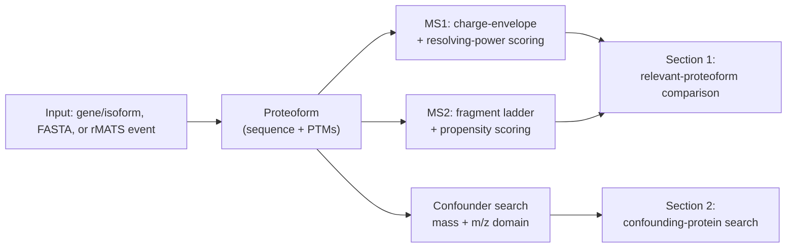

# What ProteoformTracker answers

ProteoformTracker answers a **pairwise, comparative** question:

> Given two (or more) specific proteoforms, can this mass spectrometer actually tell them apart?

It deliberately does **not** compute or output a single mass cutoff ("proteins under X kDa are
undetectable"). Two things a naive fixed-threshold check misses, and that this tool handles
explicitly instead:

## 1. The mass difference needed for resolvability isn't fixed

It scales with the pair's own mass and charge state, via the instrument's resolving power at
whatever m/z the ions actually land at:

$$
R(m/z) = R_{ref} \times \sqrt{\frac{m/z_{ref}}{m/z}}
\qquad\qquad
\Delta M_{FWHM} \approx \frac{M}{R(m/z_{best})}
$$

A rule like "Δmass ≥ 3 Da is enough" produces **false negatives** on large, easily-separable pairs
(where even a big Δmass might sit inside a wide peak) and **false positives** on small, marginal
pairs (where even a small Δmass might already be resolvable). See
[Resolving power & FWHM](resolving-power.md) for the full model and a worked example.

## 2. A resolvable pair can still be confounded by a third, unrelated protein

Even if your two proteoforms of interest are cleanly separable from *each other*, some completely
unrelated protein — from a different gene entirely — might share one of their intact masses, or
land a charge-state peak on top of one of theirs. ProteoformTracker searches the full reference
proteome for this explicitly (see [Relevant vs. confounding proteins](relevant-vs-confounding.md)),
rather than treating the pair as isolated from the rest of the proteome.

This is also the reasoning behind treating the **MS2 fragment ladder** as a first-class,
independent axis of discrimination rather than an optional extra: two proteins from different genes
essentially never share extended sequence identity, so their fragment ions diverge quickly even
when their intact masses happen to coincide. See
[Fragmentation propensity & scoring modes](fragmentation-propensity.md).

## How the pieces fit together

Every input path (gene/isoform selection, pasted FASTA, or an rMATS splicing event) resolves into
the same internal `Proteoform` representation — a mature amino-acid sequence plus a list of applied
PTMs — before any scoring runs. Everything downstream is identical regardless of which path
produced it.

## Known limitations

Stated here plainly, not hidden in a footnote — ProteoformTracker's own design spec is explicit
about these:

- The envelope-crowding check is a closed-form heuristic, not a guarantee of real
  deconvolution-algorithm (e.g. UniDec) behavior.
- The fragmentation propensity model predicts cleavage *likelihood*, not observed ion intensity —
  no mature, generalizable intensity-prediction model exists yet for intact-protein fragmentation.
- PTMs are propagated onto the proteoforms you explicitly specify, never onto background
  confounding proteins — PTM occupancy is sample/condition-specific biology, not a fixed proteome
  property, so there's no canonical "modified state" of an unrelated protein to precompute.
- Only terminal (b/y) fragment ions are modeled; internal fragments (two simultaneous cleavages)
  are out of scope — they're combinatorially far more numerous and individually much less probable
  than terminal ions.
- The Orbitrap `R(m/z)` scaling law is instrument-family specific; FT-ICR or other platforms would
  need a different resolving-power relationship.
