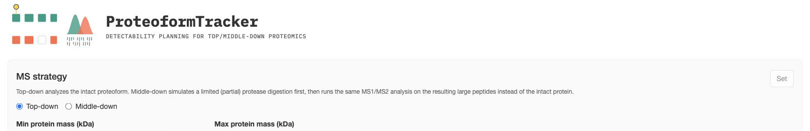

# ProteoformTracker

**ProteoformTracker** is an online web tool for isoform/proteoform-level detectability in
**top-down** and **middle-down** proteomics (TDP/MDP). It answers one specific question:

> Given a specific proteoform, can this instrument actually tell it apart from background proteoforms?

It's designed for users who already have candidate target protein isoforms — identified via
RNA-seq-based alternative-splicing analysis (short-read/NGS or long-read sequencing) and/or
literature-guided PTMs — and who plan to use TDP/MDP to identify these specific protein isoforms.

ProteoformTracker is a companion project to
[IsoPepTracker](https://github.com/HuangLabAtUAB/IsoPepTracker) (its bottom-up counterpart).

## What it does

- Takes a proteoform from **one of three input formats** — a gene's annotated isoforms, a pasted/uploaded FASTA sequence (corresponding to de novo assembled transcripts or long-read sequencing results), or an rMATS alternative-splicing event — and resolves it into a shared internal
  representation (sequence + PTMs).
- Predicts each proteoform's **MS1 charge-state envelope** (with real isotope patterns where the
  instrument would resolve them) and scores whether it's cleanly separable from every other checked
  proteoform, using an Orbitrap resolving-power model.
- Generates each proteoform's **MS2 b/y fragment ladder**, scores each bond's fragmentation
  propensity, and classifies every fragment as unique / partial / common relative to the other
  checked proteoforms — so you can see exactly which peaks would actually distinguish two isoforms.
- Searches the full reference human proteome for **confounding proteins** — unrelated proteins that
  could share your target's intact mass or a charge-state m/z peak — and lets you compare against
  a user-curated subset of them.
- Supports **middle-down** workflows (simulated partial protease digestion) as well as intact
  top-down analysis.

## Where to start

- New here? Start with [Installation & setup](getting-started/installation.md), then the
  [5-minute quick start](getting-started/quick-start.md).
- Want the concepts first? See [Rationale and technical details of ProteoformTracker's design](concepts/overview.md).
- Already running the app? Jump straight to whichever [input method](input-methods/option-1-gene.md)
  or [results page](results/section-1-relevant.md) you need.

## Source

- App repository: [github.com/HuangLabAtUAB/ProteoformTracker](https://github.com/HuangLabAtUAB/ProteoformTracker)
- Design spec (`ptracker_vibe.md` in the app repo) has the full scoring-model rationale and known
  limitations, if you want more depth than this guide covers.
