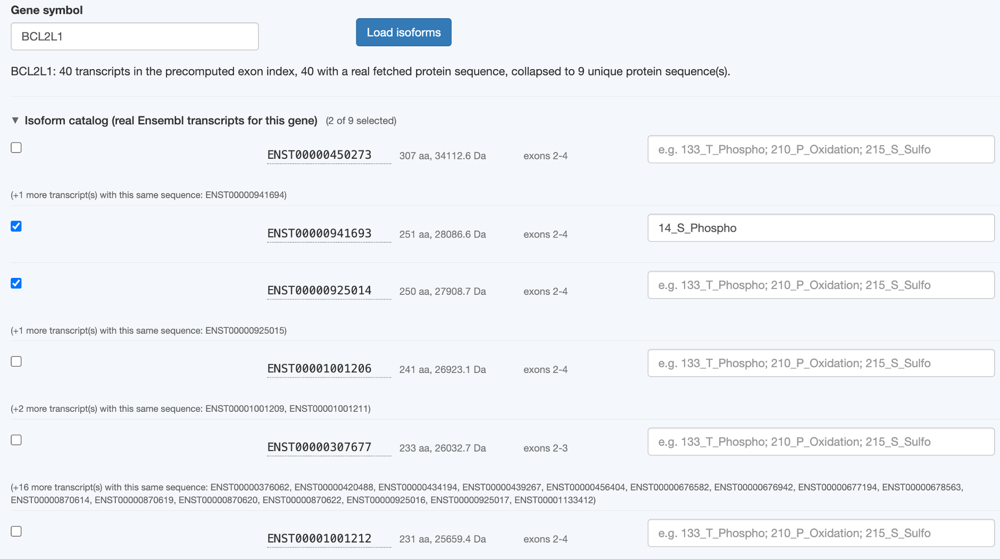
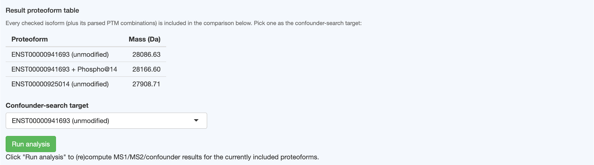

# Option 1: Gene → isoform → proteoform

The default and simplest input path: type a gene symbol, pick which of its known transcripts to
include, and optionally add PTMs.

## Load isoforms

Type a HGNC gene symbol and click **Load isoforms**:

```
BCL2L1
```

This looks the gene up in the precomputed genome-wide exon index, then fetches each transcript's
real translated protein sequence from Ensembl REST (cached to disk after the first fetch, so
re-loading the same gene later is instant). Transcripts sharing an identical protein sequence
(common — different transcripts of the same gene often differ only in UTRs) are collapsed to one
representative row, with a note listing the others.

If [top-down mode](../settings/ms-strategy.md) is active, isoforms outside the current min/max mass
window are hidden from the list entirely (with a count of how many were hidden) — they can't be
selected since they'd fall outside your instrument's usable range anyway.

## The isoform catalog

Collapsed by default after a load (a long isoform list otherwise forces scrolling past a list
you're already done picking from). Each row has:

- A checkbox — checking it adds this isoform to the comparison
- The transcript ID (hover it to see the full sequence with residue-position numbering, useful for
  writing a PTM spec — see below)
- Length and mass
- Which exons it contains
- A PTM spec text box (see [PTM specification syntax](ptm-syntax.md))



## The result proteoform table

Every checked isoform — plus one extra row for each valid PTM combination you specified — appears
here with its computed mass:



Pick one row as the **confounder-search target** (the dropdown just above **Run analysis**), then
click **Run analysis**. See [Section 1](../results/section-1-relevant.md) and
[Section 2](../results/section-2-confounders.md) for what happens next.

## Middle-down mode

If [MS strategy](../settings/ms-strategy.md) is set to Middle-down, a **Select peptides...** button
appears once you've checked at least one proteoform — see
[Middle-down mode: the peptide candidate picker](../middle-down/peptide-picker.md).
