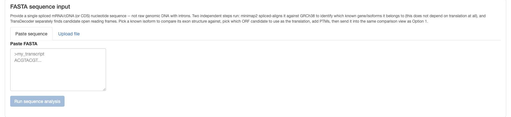

# Option 2: FASTA sequence

For a novel transcript sequence that isn't (yet) a named Ensembl isoform — e.g. a long-read
assembly or a manually assembled transcript — paste or upload a single **spliced mRNA/cDNA (or
CDS) nucleotide sequence**. Not raw genomic DNA with introns.

## Two independent steps

Clicking **Run sequence analysis** runs two steps that don't depend on each other:

1. **minimap2 spliced alignment** against GRCh38 — identifies which known gene/isoforms this
   sequence belongs to. This step never looks at translation at all.
2. **TransDecoder** — finds candidate open reading frames independently of step 1.

Both need the optional reference-genome setup described in
[Installation & setup](../getting-started/installation.md#6-optional-fasta-rmats-input-support).
If the minimap2 index isn't built yet, this tab still accepts input — it just reports that
alignment isn't available rather than erroring.

## After alignment

Once both steps finish, you get:

- A **known isoform** to compare your sequence's exon structure against (from the same gene the
  alignment matched)
- A **TransDecoder ORF candidate** dropdown — pick which candidate open reading frame is the real
  translation
- The same **PTM spec box** as [Option 1](option-1-gene.md) — see
  [PTM specification syntax](ptm-syntax.md)
- An **Add to comparison** button

Clicking **Add to comparison** sends your novel sequence into the exact same shared results view
[Option 1](option-1-gene.md) uses — the proteoform table, Section 1, and Section 2 all work
unchanged, with your novel sequence treated as just another checked proteoform (labeled
`NOVEL_1` by default). This is why the underlying `Proteoform` object exists: every input path
converges on it before any scoring code runs.

## Paste vs. upload

Either paste FASTA text directly or upload a `.fa`/`.fasta`/`.fas`/`.txt` file — both feed the same
two-step pipeline.
