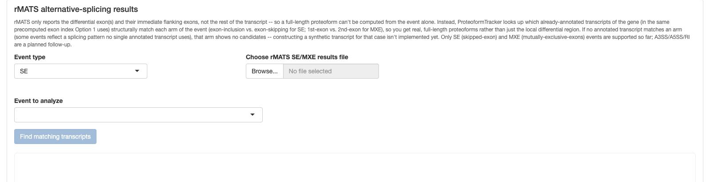

# Option 3: rMATS alternative-splicing results

For working directly from **rMATS** differential-splicing output — comparing the two arms of a
specific alternative-splicing event as full proteoforms, not just the local differential region.

## Why this needs annotated-transcript matching

rMATS only reports the differential exon(s) and their immediate flanking exons — not the rest of
the transcript — so a full-length proteoform can't be computed from the event alone. Instead,
ProteoformTracker looks up which already-annotated transcripts of the gene (in the same
precomputed exon index [Option 1](option-1-gene.md) uses) structurally match each arm of the event:

- **SE (skipped-exon)**: exon-inclusion vs. exon-skipping arms
- **MXE (mutually-exclusive-exons)**: 1st-exon vs. 2nd-exon arms

This gets you real, full-length proteoforms rather than just the local differential region. If no
annotated transcript matches a given arm (some events reflect a splicing pattern no single
annotated transcript uses), that arm simply shows no candidates — constructing a synthetic
transcript for that case isn't implemented yet.

!!! note "Supported event types"
    Only **SE** and **MXE** are supported so far. A3SS/A5SS/RI are a planned follow-up.

## Coordinate conventions worth knowing

rMATS coordinates are **0-based-start** (so `*ES` columns need `+1` to become 1-based), and rMATS'
own "upstream"/"downstream" column naming follows **genomic** coordinate order, not transcription
direction — the two flip relative to each other on a minus-strand gene. ProteoformTracker handles
this internally; it's mentioned here only so the transcript-order results don't look surprising if
you're cross-checking against the raw rMATS file yourself.

## Workflow

1. Pick the **event type** (SE or MXE) matching your results file.
2. Upload the rMATS SE/MXE results file (`.txt`/`.JC.txt`).
3. Pick which **event** (row) to analyze from the dropdown.
4. Click **Find matching transcripts**.
5. Review the matched transcripts for each arm, plus the exon-alignment preview showing where the
   differential exon(s) sit relative to the matched transcripts.
6. Click **Add to comparison** to send the matched proteoforms into the same shared results view
   [Option 1](option-1-gene.md) and [Option 2](option-2-fasta.md) use.
