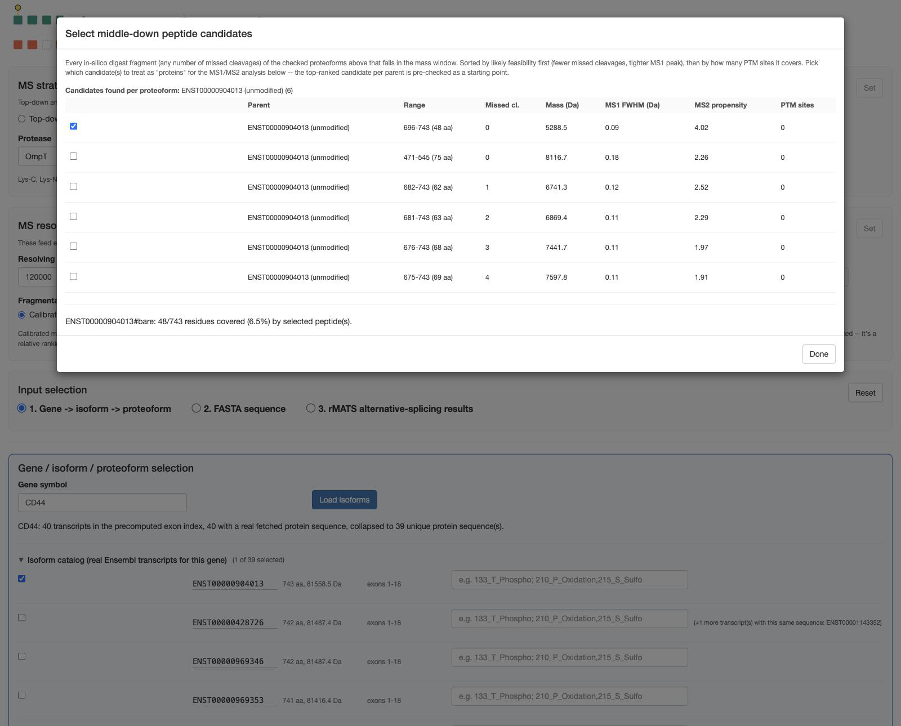

# Middle-down mode: the peptide candidate picker

When [MS strategy](../settings/ms-strategy.md) is set to **Middle-down**, ProteoformTracker
simulates a limited (partial) protease digestion of every checked proteoform, then lets you pick
which resulting large peptides to actually run the MS1/MS2 analysis on — instead of analyzing the
intact protein.

## Opening the picker

Once at least one proteoform is checked, a **Select peptides...** button appears next to a
one-line summary (how many candidates were found, across how many proteoforms). Click it to open
the picker modal:

## What's in the table

Every in-silico digest fragment (any number of missed cleavages) of the checked proteoforms that
falls within the current mass window (**Min/max peptide mass (kDa)** in
[MS strategy](../settings/ms-strategy.md)), for the protease you picked there. Columns:

| Column | Meaning |
|---|---|
| Parent | Which checked proteoform this peptide comes from |
| Range | Residue range and length |
| Missed cl. | Missed-cleavage count |
| Mass (Da) | Peptide mass |
| MS1 FWHM (Da) | Predicted peak width at this mass/charge — smaller is better |
| MS2 propensity | Average fragmentation-propensity score across this peptide's bonds |
| PTM sites | How many PTM sites (if any) this peptide range covers |

Rows are sorted by likely feasibility first (fewer missed cleavages, tighter MS1 peak), then by how
many PTM sites they cover.

## Selecting candidates

The top-ranked candidate per parent proteoform is pre-checked as a starting point — override freely.
Each checked candidate is treated as its own "protein" for every downstream MS1/MS2 step, exactly
like a top-down proteoform would be. A live coverage summary at the bottom of the modal shows what
fraction of each parent's residues are covered by your current selection.

## The "intact protein offered instead" fallback

A protease with sparse cleavage sites (OmpT, for example, only cuts rare dibasic K/R–K/R sites) can
legitimately produce **zero** real digest fragments in the mass window for a given proteoform, even
though it's checked. In that case, ProteoformTracker falls back to offering the **intact protein
itself** as a selectable candidate for that parent — flagged clearly (background tint + "0 digest
fragments in window — intact protein offered instead") rather than silently vanishing from the
list.

## After selecting

Click **Done**, then **Run analysis** as usual. Everything downstream — Section 1's MS1/MS2
comparison, Section 2's confounder search — works exactly as it does for top-down, just against the
selected peptide fragments instead of intact proteins. Confounders in middle-down mode are searched
against *other proteins' digest peptides* (cut with the same protease), not other intact proteins —
a real collision risk an intact-protein-only search would miss.
