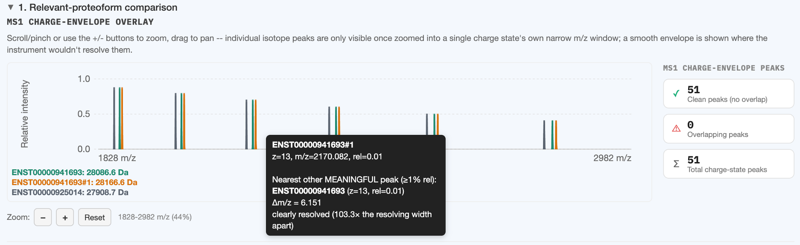
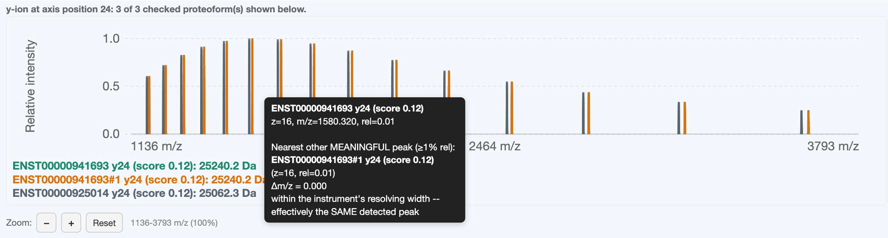

# Interacting with the charts

Every chart in ProteoformTracker (MS1 charge-envelope overlays, MS2 fragment ladders, the
fragment-isotope inspector, and the rMATS exon-alignment preview) shares the same interaction
model. This page covers all of them once.

## Zoom and pan

- **Scroll/pinch** directly on a chart to zoom, centered on the cursor.
- **Drag** to pan.
- The **+ / − / Reset** buttons above each chart do the same zoom in/out/reset-to-full-view, for
  trackpad-free use.
- A live range readout next to the zoom buttons shows the current view (e.g. residue range and
  percent of total, or an m/z range and percent, depending on the chart's domain).

Your zoom/pan position is preserved across a re-render triggered by tweaking an unrelated input
(e.g. adding a PTM to a different isoform) — it only resets to full-width when the underlying axis
itself changes length (e.g. loading a different gene).

## Hovering

### MS1 charts

Once zoomed in enough that individual peaks are distinguishable (a hint reminds you when you
haven't zoomed in enough yet), hover a peak to see its own m/z/charge/intensity plus how it relates
to the nearest **meaningful** peak (≥1% relative intensity) from a different proteoform in the same
chart — expressed in multiples of the instrument's own resolving-power FWHM at that m/z. See
[Resolving power & FWHM](../concepts/resolving-power.md) for what the ratio means.

A clearly resolved case: two proteoforms' peaks here sit 103.3× the instrument's resolving width
apart, so the hover tooltip reports them as cleanly separable rather than at risk of overlapping.

### MS2 ladder

Hover a b/y tick (same zoom-in requirement) to see that bond's fragment mass, its
[tier](../concepts/tiers.md), and its raw propensity score.

## Clicking a fragment ion (MS2 ladder only)

Click a b/y tick to open the **fragment-isotope inspector** below the ladder: that one fragment
ion's own predicted isotope pattern, computed on demand and overlaid across every other checked
proteoform (or confounder) that has a qualifying fragment at the same aligned axis position. This
is deliberately click-to-compute rather than always-on — see
[Section 1](section-1-relevant.md#inspecting-one-fragments-own-isotope-pattern) for why.

A fragment only "qualifies" for this inspector if its propensity score clears the current
[scoring mode](../concepts/fragmentation-propensity.md)'s isotope-computation gate — if you click a
bond with no qualifying proteoform, the label explains why instead of showing an empty chart.

The same resolved-vs-overlapping question the MS1 chart answers for the intact protein, answered
here for one fragment ion at a time — the same resolving-power model underlies both. This is the
opposite case from the MS1 example above: two proteoforms' y24 ions coincide exactly (Δm/z =
0.000) and are reported as effectively the same detected peak.

## Fragment filter

Above every MS2 ladder, three buttons (All fragments / Elevated / High) restrict which
bonds are drawn to those clearing a given [propensity tier](../concepts/fragmentation-propensity.md).
Two things update live when you change this:

- The **"N of M bonds shown"** readout
- The per-row **unique/partial/common badge counts** next to each proteoform's title — these are
  recomputed from only the currently-visible bonds every time you change the filter, not a static
  number from when the analysis first ran

## The isoform/gene sequence popover

In the isoform catalog (not a results chart, but the same popover mechanism), hover a transcript ID
to see its full sequence with residue-position ruler numbers — useful for writing a
[PTM spec](../input-methods/ptm-syntax.md) without counting residues by eye. Unlike the chart
tooltips, this popover accepts mouse-over itself (so you can move into it to read/select/copy the
sequence) and stays open briefly after you leave the trigger.
