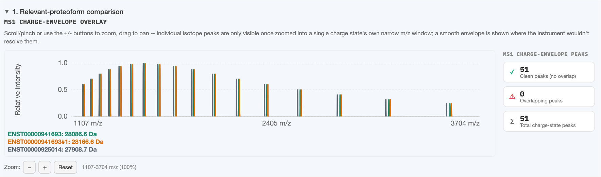
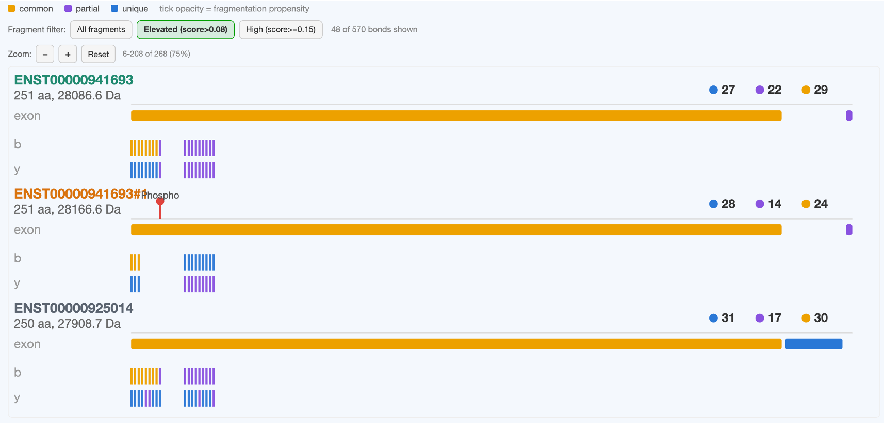

# Section 1: Relevant-proteoform comparison

Shows the full MS1 + MS2 comparison across **every proteoform you checked** — the isoforms/PTM
combinations from [Option 1](../input-methods/option-1-gene.md), a novel sequence from
[Option 2](../input-methods/option-2-fasta.md), or matched transcripts from
[Option 3](../input-methods/option-3-rmats.md). Populates automatically after **Run analysis**.

## MS1 charge-envelope overlay

Every checked proteoform's predicted charge-state envelope, overlaid on one shared m/z axis — see
[Charge-state envelopes](../concepts/charge-envelope.md) for what's actually being predicted (real
isotope combs where resolved, smooth curves where not) and how to read a hover tooltip.

The stats panel beside the chart aggregates pairwise peak-collision checks across the whole set:

- **Clean peaks** — no overlap with any other checked proteoform's peak
- **Overlapping peaks** — within the instrument's resolving-power safety margin of another peak
- **Total charge-state peaks**

Only shown with 2+ proteoforms checked (nothing to compare a single proteoform against).

## MS2 fragment ladder

One row per checked proteoform, aligned on a **shared exon axis** so proteoforms from the same gene
line up by genomic position rather than raw residue count — a 700-residue and a 743-residue isoform
of the same gene still show their shared exons at the same horizontal position.

Each row has, top to bottom:

1. **Title** — proteoform label, length, mass, and (to the right) live unique/partial/common badge
   counts — see [Tier colors](../concepts/tiers.md)
2. Any **PTM markers** (red pin + label) at their real residue position
3. **exon** track — tiered by real genomic exon-boundary comparison against the other rows
4. **b** and **y** ion tracks — tick color = tier, tick opacity = fragmentation propensity score

## Fragment filter

Buttons above the ladder (All fragments / Elevated / High) restrict which bonds are
drawn, using whichever [scoring mode](../concepts/fragmentation-propensity.md) is active. The
per-row badge counts and the "N of M bonds shown" readout both update live when you change this.

## Inspecting one fragment's own isotope pattern

Click any b/y tick (once zoomed in enough to hover it individually) to see that specific fragment
ion's own predicted isotope peaks, overlaid across every checked proteoform that has a qualifying
fragment at the same aligned position — the same resolved-vs-overlapping question the MS1 chart
answers for the intact protein, answered here for one fragment ion at a time. This is computed
on demand (not precomputed for the whole ladder) since a long proteoform can have 100+ qualifying
bonds and eagerly computing every one's isotope pattern would make **Run analysis** far slower for
no benefit until you actually click something.

See [Interacting with the charts](chart-interactions.md) for zoom/pan/hover mechanics common to
every chart in the app.
