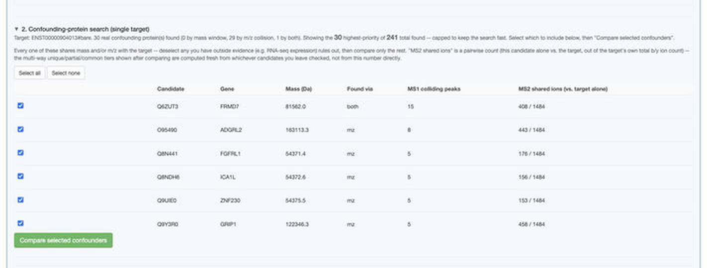
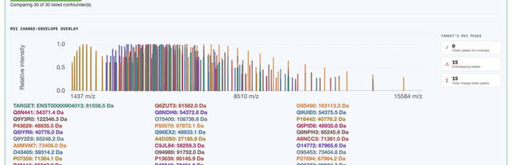
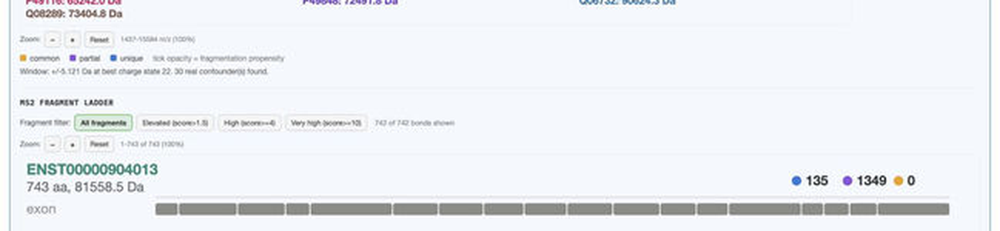

# Section 2: Confounding-protein search

Searches the full reference human proteome for real proteins — from any gene — that could be
confused with your chosen **confounder-search target** (picked from the proteoform table before
clicking **Run analysis**). See [Relevant vs. confounding proteins](../concepts/relevant-vs-confounding.md)
for the concepts behind this search; this page covers the actual on-screen workflow.

This section runs as **two separate steps**, deliberately: search first, then an explicit choice
about which results to spend the expensive computation on.

## Step 1: the search (automatic, fast)

Runs immediately as part of **Run analysis** — no isotope-pattern computation yet, just a mass/m-z
index lookup and a lightweight per-candidate fragment-ladder comparison. Produces the status line
and candidate table:

The status line reports how many were found by mass window, by m/z collision, and by both — with
the **shown vs. total-found** counts highlighted in bold when the list is capped (see
[why the list is capped](../concepts/relevant-vs-confounding.md#why-the-list-is-capped)).

Table columns:

| Column | Meaning |
|---|---|
| Candidate | UniProt accession |
| Gene | Gene symbol (parsed from the reference proteome's UniProt headers; blank for the rare entry with no `GN=` field) |
| Mass (Da) | Candidate's own intact mass |
| Found via | `mass`, `mz`, or `both` — see [Relevant vs. confounding proteins](../concepts/relevant-vs-confounding.md#two-ways-a-protein-can-confound-your-target) |
| MS1 colliding peaks | How many distinct target charge-state peaks this candidate's envelope lands on |
| MS2 shared ions (vs. target alone) | Cheap pairwise fragment-mass overlap — this candidate alone vs. the target |

## Step 2: choosing what to compare

Every row is checked by default. **Deselect** any candidate you have outside evidence for excluding
— most commonly, an RNA-seq expression call telling you it isn't actually expressed in your
sample. **Select all** / **Select none** speed up bulk changes. Click
**Compare selected confounders** to run the full comparison on whatever's still checked.

This second step is genuinely more expensive than the search — it computes a real isotope-pattern
MS1 envelope for every selected confounder plus the target, which is the same per-candidate cost
that made an uncapped, unfiltered candidate list impractically slow in earlier versions of this
tool. Narrowing your selection here directly controls how long this step takes.

## The comparison results

Once it finishes, you get the same two chart types as [Section 1](section-1-relevant.md) — MS1
overlay and MS2 ladder — but for the target against your chosen confounders:

The **target's curve is always drawn last (on top), thicker and fully opaque**, specifically because
m/z-domain confounders are curated to share peaks with the target — without this, a target curve
can get visually buried under a dozen confounder curves at exactly the positions that matter most.
Each confounder gets its own color from a fixed palette, cycling if you have more confounders
selected than palette colors.

The MS2 ladder here shows only the **target's own** row, tiered against whichever confounders you
selected — deselect a confounder and re-compare to see which of the target's fragments become
"unique" once that specific confounder is out of the picture (see
[Tier colors](../concepts/tiers.md#confounder-search-tiers-section-2)).

## Re-running with a different selection

Change checkboxes and click **Compare selected confounders** again at any time — this re-runs only
the compare step, reusing the same search results, so it's faster than a fresh **Run analysis**.
Clicking **Run analysis** itself always re-runs the search from scratch and resets your selection.
