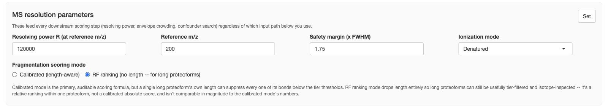

# MS resolution parameters

This panel feeds every downstream scoring step — resolving power, envelope crowding, and
confounder search — regardless of which input path you use.

| Field | Default | Meaning |
|---|---|---|
| Resolving power R (at reference m/z) | 120,000 | The instrument's quoted resolving power at the reference m/z below — see [Resolving power & FWHM](../concepts/resolving-power.md) |
| Reference m/z | 200 | Conventionally 200; the m/z at which the R value above was quoted |
| Safety margin (× FWHM) | 1.75 | Multiplier applied over the theoretical FWHM before calling a pair confidently (not just theoretically) separable |
| Ionization mode | Denatured | Denatured or Native — changes the charge-state ceiling model, see [Charge-state envelopes](../concepts/charge-envelope.md) |

## Fragmentation scoring mode

Two mutually exclusive modes, radio-selected here:

- **Calibrated (length-aware)** — the primary, auditable formula. A single very long proteoform's
  own length can suppress every one of its bonds below the tier thresholds.
- **RF ranking (no length)** — for long proteoforms whose calibrated scores are all suppressed by
  their own length; a relative ranking within one proteoform, not a calibrated absolute score, and
  not comparable in magnitude to Calibrated mode's numbers.

See [Fragmentation propensity & scoring modes](../concepts/fragmentation-propensity.md) for the
full model, tier thresholds, and fold-enrichment numbers for both modes. Switching modes after
running an analysis re-tiers and re-colors the whole MS2 ladder on the next **Run analysis** click.

## Why this panel needs its own "Set"

Like [MS strategy](ms-strategy.md), this panel requires an explicit **Set** click before any
analysis button unlocks — and re-locks itself if you change a value afterward. These parameters
aren't previewed anywhere until you click Set; they take effect on the *next* analysis run, not
retroactively on results already on screen.
