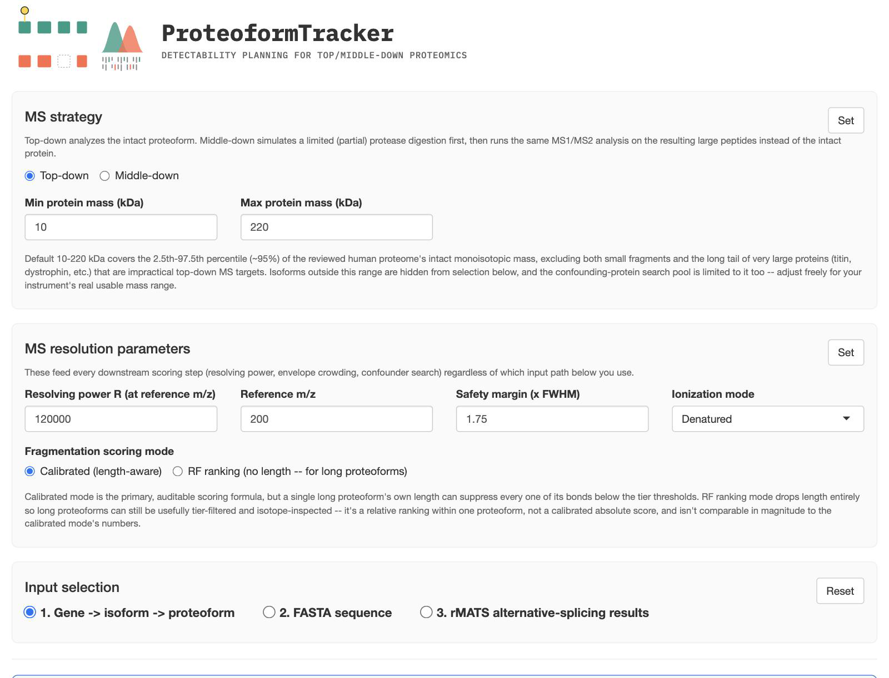
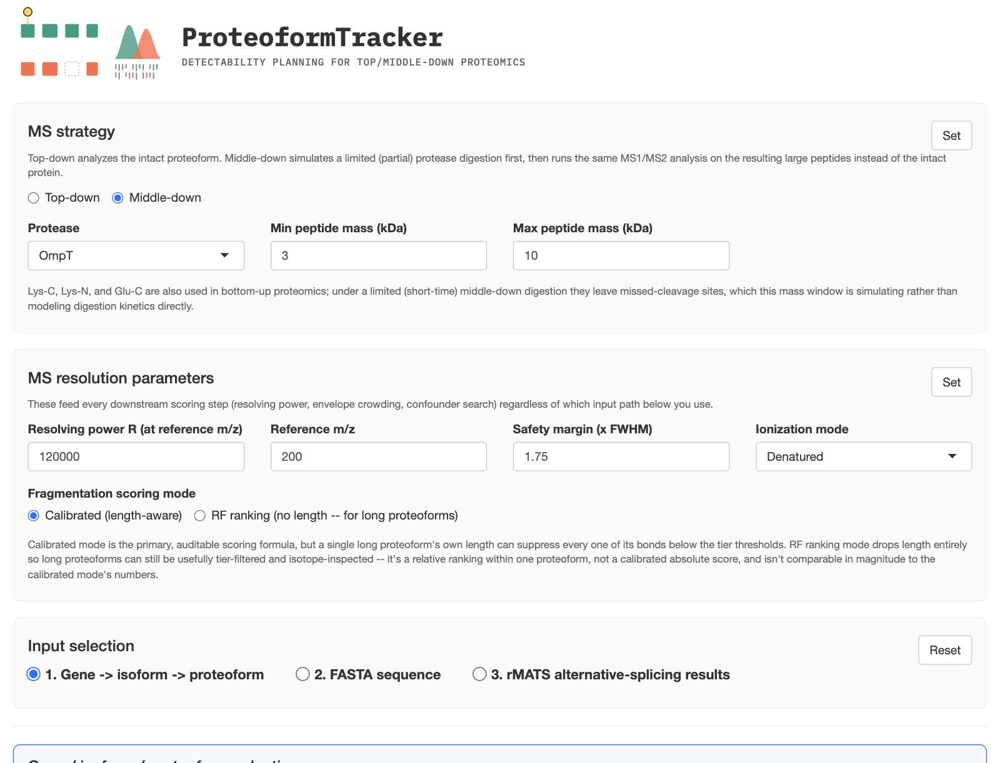

# MS strategy: top-down vs. middle-down

The **MS strategy** panel is the first thing on the page and applies globally, regardless of which
input path you use below it.

## Top-down

Analyzes the **intact proteoform** directly — the default mode, and what most of this guide's
screenshots show.

| Field | Meaning |
|---|---|
| Min protein mass (kDa) | Default 10 — the low end of the "usable" intact-mass range |
| Max protein mass (kDa) | Default 220 — the high end |

The default 10–220 kDa window covers roughly the 2.5th–97.5th percentile (~95%) of the reviewed
human proteome's intact monoisotopic mass — excluding both small fragments and the long tail of
very large proteins (titin, dystrophin, etc.) that are impractical top-down MS targets. This range
does real work in two places: isoforms outside it are hidden from selection in
[Option 1](../input-methods/option-1-gene.md), and the confounding-protein search pool
(see [Section 2](../results/section-2-confounders.md)) is restricted to it too. Widen or narrow it
to match your instrument's real usable mass range.

## Middle-down

Simulates a **limited (partial) protease digestion** first, then runs the same MS1/MS2 analysis on
the resulting large peptides instead of the intact protein.

| Field | Meaning |
|---|---|
| Protease | OmpT, Lys-C, Lys-N, Glu-C, or Asp-N |
| Min peptide mass (kDa) | Default 3 |
| Max peptide mass (kDa) | Default 10 |

Lys-C, Lys-N, and Glu-C are also common bottom-up digestion enzymes; under a limited (short-time)
middle-down digestion they leave real missed-cleavage sites, which this mass window simulates
rather than modeling digestion kinetics directly. Once middle-down is selected, checking a
proteoform surfaces a **Select peptides...** button — see
[Middle-down mode: the peptide candidate picker](../middle-down/peptide-picker.md).

## The "Set" button

Both this panel and [MS resolution parameters](ms-resolution.md) require an explicit click on their
own **Set** button before any of the "Load isoforms" / "Run sequence analysis" / "Run analysis"
buttons unlock — this is intentional, not a bug: it forces a deliberate confirmation that these
global, everything-downstream-depends-on-them settings are what you actually intend before any
computation runs. Changing anything in a panel after clicking Set greys it out again, requiring a
fresh click.
